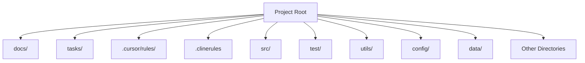
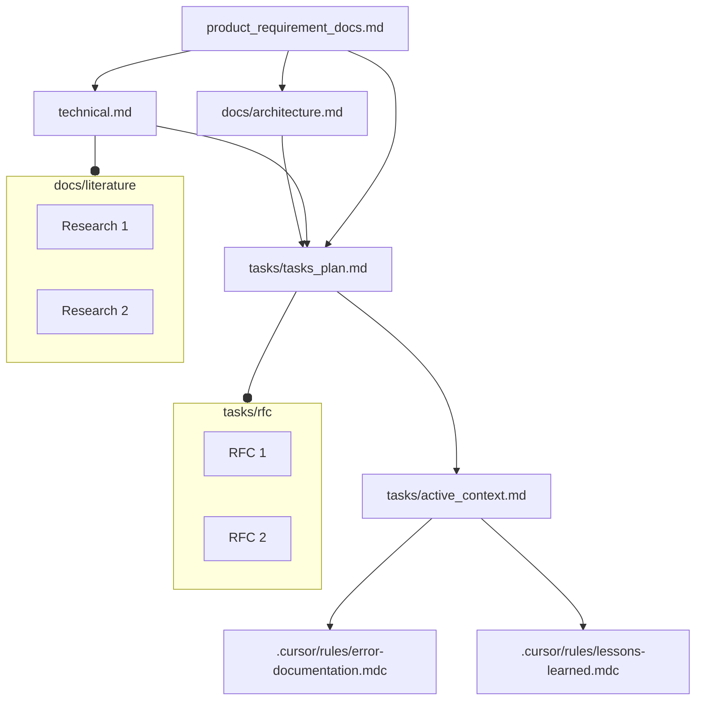

<!-- Add Badges Here (e.g., License) -->

# Universal Rules Template for AI Coding Assistants

## Supercharge Your AI Coding Workflow Across Cursor, CLINE, RooCode, and Windsurf

Tired of inconsistent AI behavior across different coding assistants? Struggling to maintain context and enforce best practices on complex projects? This template provides a robust, cross-platform framework designed to elevate your AI pair-programming experience.

Leveraging established software engineering principles and a structured documentation system, this template ensures your AI assistants (like Cursor, CLINE, RooCode, and Windsurf) operate consistently, understand your project deeply, and follow optimal workflows. Move beyond simple prototypes and build sophisticated applications with AI partners that truly understand your project's architecture, requirements, and history.

## Why Use This Template?

*   **Consistent AI Behavior:** Define clear workflows (Plan, Implement, Debug) and principles for your AI, ensuring predictable and high-quality output regardless of the platform used.
*   **Persistent Project Memory:** Implement a structured documentation system (`docs/`, `tasks/`) that acts as a shared "memory bank," providing deep context to the AI about requirements, architecture, technical decisions, and progress.
*   **Cross-Platform Compatibility:** Designed from the ground up to work seamlessly with Cursor, CLINE, RooCode, and Windsurf, respecting their specific rule-loading mechanisms.
*   **Enforce Best Practices:** Integrate fundamental software engineering principles directly into the AI's instructions, promoting code quality, maintainability, and structured development.
*   **Reduced Setup Time:** Get started quickly with a pre-configured structure and ruleset, adaptable to your specific project needs.
*   **Optimized for Complex Projects:** The structured memory and workflow approach provides the necessary context and guidance for AI assistants working on more than just simple scripts or prototypes.

## Who Is This For?

This template is particularly beneficial for:

*   **Developers working on complex projects:** Requiring deep context and structured AI assistance beyond basic code generation.
*   **Teams using multiple AI coding assistants:** Ensuring consistency in workflow and AI behavior across different tools.
*   **Individuals seeking a more structured AI workflow:** Implementing proven software engineering practices for AI collaboration.
*   **Researchers needing reproducible AI interactions:** Providing a stable framework for experiments.
*   **Anyone looking to improve the quality and reliability of AI-generated code and documentation.**

## Key Features (Benefits-Focused)

1.  **Work Seamlessly Across Platforms:** Native support and configuration guidance for Cursor, CLINE, RooCode, and Windsurf ensures your rules work consistently wherever you code.
2.  **Maintain Consistent AI Context:** The structured "Memory Bank" (core documentation files) provides deep, persistent context, reducing repetitive explanations and improving AI understanding.
3.  **Enforce Software Engineering Best Practices:** Guide your AI to follow established principles for planning, implementation, debugging, modularity, and testing.
4.  **Optimize Token Usage:** Rules are organized to leverage platform-specific loading mechanisms (where available) to minimize unnecessary token consumption.
5.  **Latest Compatibility:** Designed and tested with recent versions of the supported AI assistants.

## Quickstart: Using this Template for AI Coding

This template repository serves as the central source for master rule sets. To use these rules in your own projects, you'll utilize the `src/manage_rules.py` script provided within *this* repository. This script replaces the old `src/copy_rules.py` and `src/clean_rules.py`.

**Core Concepts:**

*   **Source Template Repo:** This repository, containing master rules (e.g., `rules_template/light-spec/`) and the `manage_rules.py` script.
*   **Target Repo:** Your project repository (e.g., `~/git/my_cool_project`) where you want to use the rules.
*   **Target Source of Truth:** A folder created *inside your Target Repo* (default: `project_rules_template/`) by the `install` command. It holds the specific rule files for *your* project, initially copied from the Source Template Repo. **Commit this folder to your Target Repo's version control.**
*   **Target Platform Rules:** Generated, platform-specific rule directories (e.g., `.cursor/rules/`, `.clinerules`, `.roo/`, `.windsurfrules`) created *inside your Target Repo* by the `sync` command. **Add these folders to your Target Repo's `.gitignore` file.**

**Workflow & Commands:**

*(Run these commands from your terminal, inside your checked-out copy of **this** `rules_template` repository)*

1.  **Install Rules into Your Project:**
    *   Use the `install` command to copy a rule template from this repo into your target project and perform an initial sync.
    *   **Command:**
        ```bash
        # Syntax: python src/manage_rules.py install <path_to_your_target_repo>
        # Example:
        python src/manage_rules.py install ~/git/my_cool_project
        ```
    *   **Action:**
        *   Copies `rules_template/light-spec/` (or another specified template) to `~/git/my_cool_project/project_rules_template/`.
        *   Generates the initial Target Platform Rules (e.g., `.cursor/rules/`, `.clinerules`) inside `~/git/my_cool_project/` based on the new `project_rules_template/`.
    *   **Follow Up:**
        *   Add the generated directories (e.g., `.cursor/`, `.clinerules`, `.roo/`, `.windsurfrules`) to your target project's (`~/git/my_cool_project/`) `.gitignore`.
        *   Commit the newly created `project_rules_template/` directory within your target project.

2.  **Customize Rules (In Your Target Project):**
    *   Modify the rule files directly within the `project_rules_template/` directory *inside your target project* (`~/git/my_cool_project/project_rules_template/`). This is where you tailor the rules for *that specific project*.

3.  **Synchronize Customizations:**
    *   After editing files in your target project's `project_rules_template/` directory, run the `sync` command to update the Target Platform Rules used by the AI assistants.
    *   **Command:**
        ```bash
        # Syntax: python src/manage_rules.py sync <path_to_your_target_repo>
        # Example:
        python src/manage_rules.py sync ~/git/my_cool_project
        ```
    *   **Action:**
        *   Reads the current rules from `~/git/my_cool_project/project_rules_template/`.
        *   Deletes existing Target Platform Rules (e.g., `.cursor/rules/`, `.clinerules`).
        *   Regenerates the Target Platform Rules based on the updated content in `project_rules_template/`.

4.  **Start Coding:**
    *   Use your AI coding assistants (Cursor, CLINE, etc.) in your target project. They will now use the synchronized, platform-specific rules.
    *   **Initial Prompt Suggestion (for setting up memory in a new project):**
        > Using the project's custom rules, initialize the Memory Bank files (docs/, tasks/) based on the project's current state or initial requirements. Follow the structure and instructions defined in the rules for documenting project context.

5.  **Clean Up (Remove Rules from Target Project):**
    *   To completely remove the rules framework (both the Target Source of Truth and the generated Platform Rules) from your target project, use the `clean` command.
    *   **Command:**
        ```bash
        # Syntax: python src/manage_rules.py clean <path_to_your_target_repo>
        # Example:
        python src/manage_rules.py clean ~/git/my_cool_project
        ```
    *   **Action:** Removes `~/git/my_cool_project/project_rules_template/` and the generated rule directories (e.g., `.cursor/`, `.clinerules`).

### Environment Setup (Using Conda)

Before running the tools described in the rules, set up the Conda environment:

1.  **Create the environment:**
    ```bash
    conda create -n rules_template python=3.11 -y 
    ```
    *(Ensure you have Conda installed. We recommend Python 3.11, but adjust if needed.)*

2.  **Activate the environment:**
    ```bash
    conda activate rules_template
    ```
    *(You'll need to activate this environment in any terminal session where you intend to run the tools.)*

3.  **Install dependencies:**
    ```bash
    pip install -r requirements.txt
    ```

4.  **Install playwright:**
    ```bash
    playwright install
    ```
5.  **Configure your environment:**
    ```bash
    - Setup your API keys in `.env` (optional, check out rules_template/light-spec/01-rules/06-rules_v1.md for API tool context) 

With the environment set up and activated, you can run the Python tools as described in the rules files (e.g., `python tools/llm_api.py ...`).

## Rule Loading Summary (Based on Official Docs & Template Implementation)

| AI Assistant | Rule Type         | Official Location & Name(s)                              | Official Loading Mechanism                                                                                                                                                           | Template Implementation & Notes                                                                                                                                                                                          |
| :----------- | :---------------- | :------------------------------------------------------- | :------------------------------------------------------------------------------------------------------------------------------------------------------------------------------------- | :----------------------------------------------------------------------------------------------------------------------------------------------------------------------------------------------------------------------- |
| **Cursor**   | Global            | Cursor Settings ("Rules for AI")                         | Always applied.                                                                                                                                                                        | N/A (User setting)                                                                                                                                                                                       |
|              | Project           | `.cursor/rules/` (contains `.mdc` files)                 | Automatic loading based on file `globs`.                                                                                                                                               | Template uses this directory structure correctly.                                                                                                                                                        |
|              | Project (Legacy)  | `.cursorrules` (root)                                    | Loaded for backward compatibility.                                                                                                                                                     | Not used by this template.                                                                                                                                                                               |
| **CLINE**    | Global            | Cline Extension Settings ("Custom Instructions")         | Always applied first.                                                                                                                                                                  | **Template Workaround:** Intended for mode-specific rules via manual copy-paste from `clinerules/plan`, `implement`, `debug`. **Currently unreliable due to UI bug.**                                               |
|              | Project           | `.clinerules` (root)                                     | Appended after Global instructions.                                                                                                                                                    | Template provides `.clinerules` for general project rules & **AI guidance** on which mode-specific file (`clinerules/plan`, etc.) to reference internally.                                                               |
|              | Project           | `.clinerules/` directory                                 | Files loaded recursively and merged after Global instructions. Takes precedence over single `.clinerules` file.                                                                        | Officially supported for general rules. Template's `clinerules/` contents (`plan`, etc.) are primarily referenced via AI guidance in `.clinerules` due to lack of native mode-specific file loading & UI bug. |
| **RooCode**  | Global            | RooCode Prompts Tab ("Custom Instructions for All Modes")  | Applied after Language Preference (if set).                                                                                                                                            | N/A (User setting)                                                                                                                                                                                       |
|              | Mode (Global)     | RooCode Prompts Tab ("Mode-specific Custom Instructions")  | Applied after Global instructions for the specific mode.                                                                                                                               | N/A (User setting)                                                                                                                                                                                       |
|              | Mode (Workspace)  | `.roo/rules-{modeSlug}/` directory                       | Preferred method. Files loaded alphabetically after Global & Mode (Prompts Tab) instructions. Takes precedence over `.roorules-{modeSlug}` file.                                      | **Template uses incorrect `.clinerules-{mode}` naming.** Files need renaming/moving to `.roo/rules-{modeSlug}/` (e.g., `.roo/rules-architect/`) to work. (See To-Do #1)                                   |
|              | Mode (Workspace)  | `.roorules-{modeSlug}` (root)                            | Fallback method if `.roo/rules-{modeSlug}/` is empty/missing.                                                                                                                          | Not used by this template.                                                                                                                                                                               |
|              | Workspace         | `.roo/rules/` directory                                  | Preferred method. Files loaded alphabetically after all Mode instructions. Takes precedence over `.roorules` file.                                                                     | **Template uses incorrect `.clinerules` naming.** General rules (memory, dir-structure) should be moved here. (See To-Do #1)                                                                         |
|              | Workspace         | `.roorules` (root)                                       | Fallback method if `.roo/rules/` is empty/missing.                                                                                                                                     | Not used by this template.                                                                                                                                                                               |
| **Windsurf** | Global            | `global_rules.md` (via Windsurf Settings)                | Always applied first. Max 6000 chars.                                                                                                                                                  | N/A (User setting)                                                                                                                                                                                       |
|              | Workspace         | `.windsurfrules` (root)                                  | Applied after Global rules. Max 6000 chars. Total rules capped at 12000 chars.                                                                                                         | Template does not yet provide an example `.windsurfrules` file (Task 5.2).                                                                                                                               |

# Tips in General Using Cursor, CLINE, RooCode, Windsurf:
## CLINE/RooCode:
1. Every time you change Roo Code **mode** in the middle of an task, it changes the system prompt and reset the prompt caching.

# The Rules Template: Universal Rules for AI Coding Assistants 🔥 

This template provides a robust and adaptable framework of rules designed to enhance the performance of AI coding assistants like Cursor and CLINE. Rooted in established software engineering principles and documentation best practices, it ensures consistent and effective AI-assisted development across different platforms.

## Directory Structure

Below is the top-level directory structure from <em>clinerules/directory-structure</em>. This structure is central to how the project is organized:



• <code>.cursor/rules/</code> – Custom rules for Cursor  
• <code>.clinerules/</code> – Custom rules for CLINE  
• <code>docs/</code> – Project documentation, architecture, and reference materials  
• <code>tasks/</code> – Task plans, active context, RFCs, and general to-do items  
• <code>src/</code> – Main source code  
• <code>test/</code> – Testing suite  
• <code>utils/</code> – Utility scripts or libraries  
• <code>config/</code> – Configuration files  
• <code>data/</code> – Data resources  
• (and potentially more directories as the project grows)

## Core Principles
The main aim of this template is to have rules that are fundamentally backed by software engineering concepts and have a documentation that is usually followed in large software teams.

The same documentation will form the context for the AI Coding.
Now, these same rules have been written for Cursor, CLINE and Windsurf custom rules format. Thus, having a uniform rule based across these systems. And as the context is saved as documentation in the files, so it is platform agnostic.

This template is built upon two fundamental pillars:

**a) Software Engineering Best Practices:**  Embracing time-tested methodologies to ensure code quality, maintainability, and efficiency.

**b) Software Development Documentation:**  Leveraging comprehensive documentation to provide context, guide development, and serve as persistent memory for AI coding assistants.

By combining these principles, the Rules Template aims to provide a structured and reliable approach to AI-assisted coding.
And based on the popular knowledge and research in these two fileds, we came up with this template.

# Rule Files:

This template relies on a carefully orchestrated system of directories and files for Cursor, Windsurf, CLINE and RooCode Within each environment, there are exactly three crucial files that shape how the AI operates:

1. <strong>rules</strong> –
   Thois can house generic rules. Bring your own flavour to this minimal document. Below are three files: (a) plan, (b) implement, (c) debug, that defines workflows for these three tasks based on refining 100s of rule repositories and software engineering best practices:

2. <strong>plan</strong> – Defines the Workflow to be followed for any Planning based on *chain of thinking*. includes **exhaustive searching and optimal plan, rigourous reasoning and user validation**.
3. <strong>implement</strong> - Defines the Workflow to be followed for any Implementation. inspired by concepts like **seperation of concerns, modular design, and incremental development**. Has testing mandatory after every significant implementation.
4. <strong>debug</strong> - This file defines rules for debugging when stuck in a loop or a hard debugging. Supports looking at the web and for previously solved errors too.
5. <strong>memory</strong> –
   Next comes the recommended documentation. Software documentation starts with PRDs Recording the requirements, architecture plan, technical plan, and the RFCs for individual functionality or group of functionalities.
So our documentation that also served as a context is very relevant for an AI cod as it has mostly the knowledge and the skills to work on and with these proper software documentations.
6. <strong>directory-structure</strong> (directory-structure) –
   This is a very simple file stating the directory structure so that all parts of a project development is covered like : (a) code, (b) test, (c) configurations, (d) data, (e) project rules, etc separately and in modular approach.

In <strong>Cursor </strong>, these three files reside in <code>.cursor/rules</code>:

```bash
.cursor/rules/rules.mdc
.cursor/rules/plan.mdc
.cursor/rules/implement.mdc
.cursor/rules/debug.mdc
.cursor/rules/memory.mdc
.cursor/rules/directory-structure.mdc
```
In **CLINE**, this template uses the `clinerules/` directory for files intended for AI guidance (via `.clinerules`) or manual copy-paste into UI settings:
```bash
clinerules/
├── plan
├── implement
└── debug
# Plus the .clinerules file at the root for general project rules & AI mode guidance.
```
For **RooCode**, the *correct* structure (which this template needs to adopt - See To-Do #1) would be:
```bash
.roo/
├── rules/              # Workspace-wide rules (e.g., memory, dir-structure)
│   └── ...
├── rules-architect/    # Mode-specific rules (e.g., plan)
│   └── ...
├── rules-code/         # Mode-specific rules (e.g., implement)
│   └── ...
└── rules-debug/        # Mode-specific rules (e.g., debug)
    └── ...
```
For **Windsurf**, use `.windsurfrules` for workspace rules:
```bash
.windsurfrules
```


## Key Files and Concepts

This template is organized around three core files, each addressing a critical aspect of the development process:

### 1. Plan/Implement/Debug: Systematic Workflow for Tasks

The `rules` files (located in `clinerules/rules` and `cursor/rules/rules.mdc`) define a structured, five-phased workflow for approaching any development task, regardless of granularity. This workflow is based on standard software engineering best practices and promotes a systematic approach to problem-solving.

**Five-Phased Workflow:**

**(i) Requirements and Clarifications:**

   it starts with making the requirements very clear and asking as much clarification as possible in the beginning. This is always the first task software development. Where all the requirements are made as precise and verbose as possible so as to save Time and effort later in redoing. Plus anticipate Major bottlenecks ahead of any work.

**(ii) Exhaustive Searching and Optimal Plan:**
  exhaustive searching and optimal plan: search all possible directions in which the problem can be solved. And find out the optimal solution, which can be also a amalgamation of many different approaches. And reason rigourously, why the chosen approach is optimal.

**(iii) User Validation:**

  validate the developed optimal plan with the user clearly stating the assumptions and design decisions made, and the reasons for them.

**(iv) Implementation:**

   implement proposed plan in an iterative way, taking one functionality at a time, testing it exhaustively with all the cases. And then building the next functionality. In this way to make the system, robust and incremental.

**(v) Further Suggestions:**

   after implementation, suggesting possible optimisation to be done or possible, additional features for security or functionality to be added.

So this five phased approach, is for a software life-cycle. But this can be applied for any grnuarlity, like entire project or a single functionality. For example, very clearly recording the requirement for the functionality and asking clarifying questions is as good for a single small functionality as for a program.
So this five phased, solution strategy workflow is to be followed at every part of development.

### 2. Memory: Persistent Project Documentation

The `memory` files (located in `clinerules/memory` and `cursor/rules/memory.mdc`) establish a robust documentation system that serves as persistent memory for the project and the AI assistant. This system is inspired by standard software development documentation practices, including PRDs, architecture plans, technical specifications, and RFCs. So, keeping these software life-cycle documentation is as focus. We develop our memory bank to have these document in sync to provide the complete context for the project. We have few additional files for current context and task plan in tasks/.


**Memory Files Structure:**

The memory system is structured into Core Files (required) and Context Files (optional), forming a hierarchical knowledge base for the project.


**Core Files (Required):**

  1.  **`product_requirement_docs.md` (docs/product_requirement_docs.md):** Product Requirement Document (PRD) or Standard Operating Procedure (SOP).
    - Defines the project's purpose, problems it solves, core requirements, and goals.
    - Serves as the foundational document and source of truth for project scope.

    Product Requirement Documents (PRDs) are foundational blueprints in software development, defining what a product should achieve and guiding teams to align on scope, features, and objectives .


2.  **`architecture.md` (docs/architecture.md):** System Architecture Document.
    - Outlines the system's design, component relationships, and dependencies.

    Software architecture documentation is a blueprint that captures design decisions, component interactions, and non-functional requirements.


3.  **`technical.md` (docs/technical.md):** Technical Specifications Document.
    - Details the development environment, technologies used, key technical decisions, design patterns, and technical constraints.


4.  **`tasks_plan.md` (tasks/tasks_plan.md):** Task Backlog and Project Progress Tracker.
    - Provides an in-depth list of tasks, tracks project progress, current status, and known issues.

5.  **`active_context.md` (tasks/active_context.md):** Active Development Context.
    - Captures the current focus of development, active decisions, recent changes, and next steps.

6.  **`error-documentation.mdc` (.cursor/rules/error-documentation.mdc):** Error Documentation.
    - Documents reusable fixes for mistakes and corrections, serving as a knowledge base of known issues and resolutions.

7.  **`lessons-learned.mdc` (.cursor/rules/lessons-learned.mdc):** Lessons Learned Journal.
    - A project-specific learning journal that captures patterns, preferences, and project intelligence for continuous improvement.

**Context Files (Optional):**

**NOTE**: I use LATEX, but you can use .md or any other format.
1.  **`docs/literature/`:** Literature Survey and Research Directory.
    - Contains research papers and literature surveys in LaTeX format (`docs/literature/*.tex`).

2.  **`tasks/rfc/`:** Request for Comments (RFC) Directory.
    - Stores RFCs for individual tasks in LaTeX format (`tasks/rfc/*.tex`), providing detailed specifications and discussions for specific functionalities.


**Additional Context:**

Further files and folders can be added within `docs/` or `tasks/` to organize supplementary documentation such as integration specifications, testing strategies, and deployment procedures.

### 3. Directory Structure: Modular Project Organization

The `directory-structure` files (located in `clinerules/directory-structure` and `cursor/rules/directory-structure.mdc`) define a clear and modular directory structure to organize project files logically. This structure promotes separation of concerns and enhances project maintainability. This is a very simple file stating the directory structure so that all parts of a project development is covered like : (a) code, (b) test, (c) configurations, (d) data, e.g. project rules, etc separately and in modular approach.

**Directory Structure Diagram:**


This structure ensures that different aspects of the project, such as code, tests, configurations, and documentation, are kept separate and well-organized.

## Advantages of Using the Rules Template

1.  **Cross-Platform Compatibility:** Usable seamlessly with Cursor, CLINE, RooCode, Windsurf, and other AI coding assistants.
2.  **Context Sharing:** Enables context sharing and consistent workflows across different AI assistants, facilitating collaborative and platform-agnostic development.
3.  **Up-to-Date Compatibility:** Designed to be compatible with the latest versions of Cursor and CLINE, ensuring long-term usability.
4.  **Automated Documentation Generation:**  Provides the foundation for automatically generating comprehensive project documentation in PDF format, streamlining documentation efforts.
5.  **Amalgamation of Memory and Custom Prompts:** Combines the benefits of persistent project memory with customizable prompts (like `.clinerules/.cursorrules`) for a balanced approach to AI-assisted coding.
6.  **Foundation in Software Engineering Principles:** Built upon established software engineering and documentation best practices, ensuring a robust and reliable framework.
7.  **Precise Control and Flexibility:** Strikes a balance between providing precise guidance to LLMs and allowing for exploration and adaptability in problem-solving.
8.  **Adaptation of Traditional Software Engineering:** Bridges the gap between traditional software engineering methodologies and modern AI-assisted development.
9.  **Potential for Auto-Evolving Rules:**  Opens up possibilities for AI-driven rule evolution and refinement, allowing the template to adapt and improve over time.

By adhering to the principles and structure outlined in this Rules Template, development teams can leverage AI coding assistants more effectively, ensuring consistency, quality, and maintainability across their projects.

## To-Do:
- [x] 1: **Adapt template files for RooCode's official format.** Rename/move `.clinerules` content (memory, dir-structure) and `.clinerules-{mode}` files (plan, implement, debug) into the correct `.roo/rules/` and `.roo/rules-{modeSlug}/` structure.
- [x] 2: Add example content to each file (Task 3 in tasks_plan.md)
- [ ] 3: Add FAQs (Task 4 in tasks_plan.md)
- [x] 4: Investigate RooCode incompatibility claim (Task 6 in tasks_plan.md - *Note: This claim in the old README seems unfounded based on official docs*).
- [x] 5: Explore native CLINE loading alternatives (Task 7 in tasks_plan.md)
- [x] 6: Improve `.clinerules` guidance (Task 9 in tasks_plan.md)
- [x] 7: Create example `.windsurfrules` file (Task 5.2 in tasks_plan.md)

## Additional Notes:

1. **Product Requirements Documents (PRDs):** PRDs serve multiple purposes: defining product scope and goals, aligning stakeholders across teams, and mitigating risks early in development. They offer significant utility by providing clarity on product vision, prioritizing features, ensuring quality, and enabling traceability throughout the development lifecycle . While traditionally detailed in Waterfall, PRDs are adapted for Agile methodologies as leaner, iterative documents. Related documents include Market Requirements Documents (MRDs) and Functional Requirements Documents (FRDs).
2. **Architecture Documentation:** It serves to preserve design rationale, support scalability, and facilitate decision-making. Key benefits include improved knowledge sharing, risk mitigation, and stakeholder communication. Types of architecture documentation vary, including decision-centric ADRs, structural C4 model diagrams, and behavioral sequence diagrams. Frameworks like arc42 provide structured templates for comprehensive architecture documentation.
3. **Technical Specifications:** Technical Specifications Documents (TSDs) serve as blueprints translating business needs into technical guidelines. They clarify project vision, bridge stakeholder communication, and mitigate risks. TSDs are highly useful for engineers as step-by-step guides, for teams as alignment tools, and for projects in ensuring accountability. Technical documentation broadly includes process documentation (user manuals, API docs), and specialized specs for IT or Agile projects. A robust TSD enhances project clarity and reduces failure risks associated with unclear requirements.
4. **RFCs (Request for Comments):** Request for Comments (RFCs) are structured proposals for technical decision-making and standardization. They document technical specifications, solicit feedback, and preserve institutional knowledge. RFCs enhance utility by reducing silos, mitigating risks, and ensuring decision traceability. Types range from standards-track protocol specifications to organizational RFCs for team-specific designs. Modern RFCs often include problem statements, proposed solutions, alternatives, rollout plans, and security impact assessments. While RFCs improve decision quality, they also pose challenges like time overhead and consensus bottlenecks.
