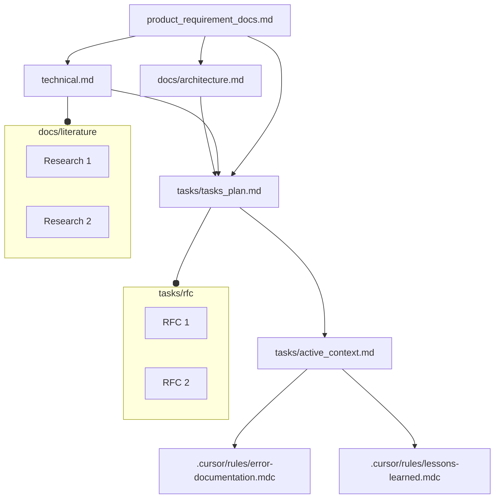
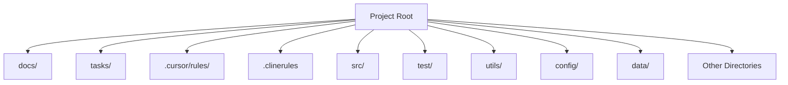

<!-- Add Badges Here (e.g., License) -->

# Universal Rules Template for AI Coding Assistants

* Bugs or ideas → open an **Issue** in the repo  
* Anonymous feedback: [Go to the Google Form](https://docs.google.com/forms/d/e/1FAIpQLSeW57QtPEWIRhHY1iOb8f5KQZTGLSeeb_PN2iZLd0Aw_pVYxw/viewform?usp=header)

## Supercharge Your AI Coding Workflow Across Cursor, CLINE, RooCode, Windsurf, and Github Copilot

Tired of inconsistent AI behavior across different coding assistants? Struggling to maintain context and enforce best practices on complex projects? This template provides a robust, cross-platform framework designed to elevate your AI pair-programming experience.

Leveraging established software engineering principles and a structured documentation system, this template ensures your AI assistants (like Cursor, CLINE, RooCode, Windsurf, and Github Copilot) operate consistently, understand your project deeply, and follow optimal workflows. Move beyond simple prototypes and build sophisticated applications with AI partners that truly understand your project's architecture, requirements, and history.

## Why Use This Template?

*   **Consistent AI Behavior:** Define clear workflows (Plan, Implement, Debug) and principles for your AI, ensuring predictable and high-quality output regardless of the platform used.
*   **Persistent Project Memory:** Implement a structured documentation system (`docs/`, `tasks/`) that acts as a shared "memory bank," providing deep context to the AI about requirements, architecture, technical decisions, and progress.
*   **Cross-Platform Compatibility:** Designed from the ground up to work seamlessly with Cursor, CLINE, RooCode, Windsurf, and Github Copilot, respecting their specific rule-loading mechanisms.
*   **Enforce Best Practices:** Integrate fundamental software engineering principles directly into the AI's instructions, promoting code quality, maintainability, and structured development.
*   **Reduced Setup Time:** Get started quickly with a pre-configured structure and ruleset, adaptable to your specific project needs.
*   **Optimized for Complex Projects:** The structured memory and workflow approach provides the necessary context and guidance for AI assistants working on more than just simple scripts or prototypes.

## Who Is This For?

This template is particularly beneficial for:

*   **Developers working on complex projects:** Requiring deep context and structured AI assistance beyond basic code generation.
*   **Teams using multiple AI coding assistants:** Ensuring consistency in workflow and AI behavior across different tools.
*   **Individuals seeking a more structured AI workflow:** Implementing proven software engineering practices for AI collaboration.
*   **Researchers needing reproducible AI interactions:** Providing a stable framework for experiments.
*   **Anyone looking to improve the quality and reliability of AI-generated code and documentation.**

## Key Features (Benefits-Focused)

1.  **Work Seamlessly Across Platforms:** Native support and configuration guidance for Cursor, CLINE, RooCode, Windsurf, and Github Copilot ensures your rules work consistently wherever you code.
2.  **Maintain Consistent AI Context:** The structured "Memory Bank" (core documentation files) provides deep, persistent context, reducing repetitive explanations and improving AI understanding.
3.  **Enforce Software Engineering Best Practices:** Guide your AI to follow established principles for planning, implementation, debugging, modularity, and testing.
4.  **Optimize Token Usage:** Rules are organized to leverage platform-specific loading mechanisms (where available) to minimize unnecessary token consumption.
5.  **Latest Compatibility:** Designed and tested with recent versions of the supported AI assistants.

## Leveraging Your AI's Enhanced Brain: Example Interactions

Once Rulebook-AI is set up with a chosen rule set (in `project_rules/`) and the memory bank (in `memory/`), you can interact with your AI coding assistant much more effectively. Here are a few crucial examples of how to leverage this enhanced context and guidance. Remember to use your AI assistant's specific syntax for referencing files (e.g., `@filename` in Cursor or Copilot).

1.  **Maintain Project Structure & Planning:**
    *   **Goal:** Use the AI to help keep your project documentation and task lists up-to-date.
    *   **Example Prompt (in your AI chat):**
        ```
        Based on section 3.2 of @memory/docs/product_requirement_docs.md, create three new tasks in @memory/tasks/tasks_plan.md for the upcoming 'User Profile Redesign' feature. For each task, include a brief description, assign it a unique ID, and estimate its priority (High/Medium/Low).
        ```
    *   **Why this is important:** This demonstrates the AI actively participating in project management by updating the "memory bank" itself. It ensures your planning documents stay synchronized with insights derived from foundational requirements, turning the AI into a proactive assistant beyond just code generation.
2.  **Retrieve Context-Specific Information Instantly:**
    *   **Goal:** Quickly access key project details without manually searching through documents.
    *   **Example Prompt (in your AI chat):**
        ```
        What is the current status of task 'API-003' as listed in @memory/tasks/tasks_plan.md? Also, remind me which database technology we decided on according to @memory/docs/architecture.md.
        ```
    *   **Why this is important:** This highlights the power of the "persistent memory bank." The AI acts as a knowledgeable team member, capable of quickly recalling specific project decisions, technical details, and task statuses, significantly improving your workflow efficiency.
3.  **Implement Features with Deep Context & Guided Workflow:**
    *   **Goal:** Guide the AI to develop code by following defined procedures and referencing precise project context.
    *   **Example Prompt (in your AI chat):**
        ```
        Using the workflow defined in @project_rules/implement.md, please develop the `updateUserProfile` function. The detailed requirements for this function are specified under the 'User Profile Update' task in @memory/tasks/active_context.md. Ensure the implementation aligns with the API design guidelines found in @memory/docs/technical.md.
        ```
    *   **Why this is important:** This is the core development loop where Rulebook-AI shines. It shows the AI leveraging both the *procedural rules* (how to approach implementation, from `project_rules/\`) and the rich *contextual memory* (what to implement and its surrounding technical landscape, from `memory/\`). This leads to more accurate, consistent, and context-aware code generation, reducing rework and improving quality.

These examples illustrate how providing structured rules and a persistent memory bank allows for more sophisticated and productive interactions with your AI coding assistant. Experiment with referencing different files from your `project_rules/\` and `memory/\` directories to best suit your workflow.

## Quickstart: Using this Template for AI Coding

This template repository serves as the central source for master rule sets. To use these rules in your own projects, you'll utilize the `src/manage_rules.py` script provided within *this* repository.

**Core Concepts:**

*   **Source Template Repo:** This repository, containing master rule sets (in `rule_sets/`), master memory bank starter documents (in `memory_starters/`), master tool starters (in `tool_starters/`), and the `manage_rules.py` script.
*   **Target Repo:** Your project repository (e.g., `~/git/my_cool_project`) where you want to use the rules.
*   **Target Project Rules Directory:** A folder named **`project_rules/`** created *inside your Target Repo* by the `install` command. It holds the specific rule files for *your* project, copied from a chosen set in the Source Template Repo's `rule_sets/` directory. This folder is used by the `sync` command and **removed by the `clean-rules` command**. It is managed by the script, though you can version control it for manual backups if desired.
*   **Target Memory Bank Directory:** A folder named **`memory/`** created *inside your Target Repo* during installation. It's populated with project-specific memory documents from the Source Template Repo's `memory_starters/` (new starter files are copied if they don't exist; existing files are **not** overwritten). **This folder should be version controlled in your Target Repo.**
*   **Target Tools Directory:** A folder named **`tools/`** created *inside your Target Repo* during installation. It's populated with utility scripts or configurations from the Source Template Repo's `tool_starters/` (new starter files/subdirectories are copied if they don't exist; existing files/subdirectories are **not** overwritten). **This folder should be version controlled in your Target Repo.**
*   **Target `env.example` and `requirements.txt`:** The `env.example` and `requirements.txt` files are copied from the Source Template Repo's root to *your Target Repo's root* during installation (non-destructively; existing files are preserved). **These files should be version controlled in your Target Repo.**
*   **Target Platform Rules:** Generated, platform-specific rule directories/files (e.g., `.cursor/rules/`, `.clinerules/`, `.roo/`, `.windsurfrules`, `.github/copilot-instructions.md`) created *inside your Target Repo* by the `sync` command using `project_rules/` as input. **These folders/files should be added to your Target Repo's `.gitignore` file.**

**Workflow & Commands:**

*(Run these commands from your terminal, inside your checked-out copy of **this** `rules_template` repository)*

1.  **List Available Rule Sets (Optional):**
    *   Use the `list-rules` command to see which rule sets are available for installation from this Source Template Repo.
    *   **Command:**
        ```bash
        python src/manage_rules.py list-rules
        ```
    *   **Action:** Scans the `rule_sets/` directory in this repository and lists all available rule set names.

2.  **Install Rules and Framework Components into Your Project:**
    *   Use the `install` command to copy a chosen rule set, memory starters, and tool starters from this repo into your target project, and then perform an initial sync.
    *   **Command:**
        ```bash
        # Syntax: python src/manage_rules.py install <path_to_your_target_repo> [--rule-set <rule_set_name>]
        # Example (using default 'light-spec' rule set):
        python src/manage_rules.py install ~/git/my_cool_project
        # Example (specifying a rule set):
        python src/manage_rules.py install ~/git/my_cool_project --rule-set heavy-spec
        ```
    *   **Action:**
        *   Copies the specified rule set (default: `light-spec`) from this repo's `rule_sets/<rule_set_name>/` to `~/git/my_cool_project/project_rules/`. (Overwrites `project_rules/` if it exists, with a warning).
        *   Copies content from this repo's `memory_starters/` to `~/git/my_cool_project/memory/` (non-destructively; existing files are preserved).
        *   Copies content from this repo's `tool_starters/` to `~/git/my_cool_project/tools/` (non-destructively; existing files/subdirectories are preserved).
        *   Copies `env.example` and `requirements.txt` from this repo's root to `~/git/my_cool_project/` (non-destructively; existing files are preserved).
        *   Automatically runs the `sync` command to generate the initial Target Platform Rules (e.g., `.cursor/rules/`, `.clinerules/`, `.github/copilot-instructions.md`) inside `~/git/my_cool_project/` based on the new `project_rules/`.
    *   **Follow Up:**
        *   Add the generated directories/files (e.g., `.cursor/`, `.clinerules/`, `.roo/`, `.windsurfrules`, `.github/copilot-instructions.md`) to your target project's (`~/git/my_cool_project/`) `.gitignore`.
        *   Commit the newly created/updated `memory/`, `tools/`, `env.example`, and `requirements.txt` files/directories within your target project.
        *   Note: The `project_rules/` directory is managed by this script (it's replaced by `install` and removed by `clean-rules`).

3.  **Customize Rules (In Your Target Project's `project_rules/` - Advanced):**
    *   If you need to make project-specific modifications to the rule sources *before* they are processed by `sync`, you can modify files directly within the `project_rules/` directory *inside your target project* (`~/git/my_cool_project/project_rules/`).
    *   **Important:** Be aware that the `clean-rules` command will remove the entire `project_rules/` directory. If you make customizations here, ensure you have a backup or understand they will be lost if you run `clean-rules` and then `install` again. For persistent project-specific AI guidance, focus on customizing the `memory/` and `tools/` directories.

4.  **Synchronize Customizations (if `project_rules/` was manually changed):**
    *   If you've manually edited files in your target project's `project_rules/` directory, run the `sync` command to update the Target Platform Rules used by the AI assistants.
    *   **Command:**
        ```bash
        # Syntax: python src/manage_rules.py sync <path_to_your_target_repo>
        # Example:
        python src/manage_rules.py sync ~/git/my_cool_project
        ```
    *   **Action:**
        *   Reads the current rules from `~/git/my_cool_project/project_rules/`.
        *   Deletes existing Target Platform Rules (e.g., `.cursor/rules/`, `.clinerules/`).
        *   Regenerates the Target Platform Rules based on the updated content in `project_rules/`.

5.  **Start Coding:**
    *   Use your AI coding assistants (Cursor, CLINE, etc.) in your target project. They will now use the synchronized, platform-specific rules.
    *   **Initial Prompt Suggestion (for setting up memory in a new project):**
        > Using the project's custom rules, initialize the Memory Bank files (docs/, tasks/) based on the project's current state or initial requirements. Follow the structure and instructions defined in the rules for documenting project context.

6.  **Clean Up Rules (Preserving Memory & Tools):**
    *   To remove the generated Target Platform Rules and the `project_rules/` directory from your target project, while keeping your customized `memory/` and `tools/` directories intact, use the `clean-rules` command.
    *   **Command:**
        ```bash
        # Syntax: python src/manage_rules.py clean-rules <path_to_your_target_repo>
        # Example:
        python src/manage_rules.py clean-rules ~/git/my_cool_project
        ```
    *   **Action:** Removes `~/git/my_cool_project/project_rules/` and the generated rule directories/files (e.g., `.cursor/`, `.clinerules/`, `.github/copilot-instructions.md`). The `memory/` and `tools/` directories are **not** affected.

7.  **Clean Up All Framework Components (Full Uninstall):**
    *   To completely remove *all* framework components (Target Platform Rules, `project_rules/`, `memory/`, `tools/`, `env.example`, and `requirements.txt`) from your target project, use the `clean-all` command.
    *   **Important:** This command will prompt for confirmation because it removes `memory/`, `tools/`, `env.example`, and `requirements.txt`, which may contain your project-specific customizations.
    *   **Command:**
        ```bash
        # Syntax: python src/manage_rules.py clean-all <path_to_your_target_repo>
        # Example:
        python src/manage_rules.py clean-all ~/git/my_cool_project
        ```
    *   **Action:** After confirmation, removes `project_rules/`, `memory/`, `tools/`, `env.example`, `requirements.txt`, and all generated rule directories/files from `~/git/my_cool_project/`.

### Environment Setup (Using Conda)

Before running the tools described in the rules, set up the Conda environment:

1.  **Create the environment:**
    ```bash
    conda create -n rules_template python=3.11 -y 
    ```
    *(Ensure you have Conda installed. We recommend Python 3.11, but adjust if needed.)*

2.  **Activate the environment:**
    ```bash
    conda activate rules_template
    ```
    *(You'll need to activate this environment in any terminal session where you intend to run the tools.)*

3.  **Install dependencies:**
    ```bash
    pip install -r requirements.txt
    ```

4.  **Install playwright:**
    ```bash
    playwright install
    ```
5.  **Configure your environment:**
    ```bash
    - Setup your API keys in `.env` (optional, check out rules_template/light-spec/01-rules/06-rules_v1.md for API tool context) 

With the environment set up and activated, you can run the Python tools as described in the rules files (e.g., `python tools/llm_api.py ...`).

## Rule Loading Summary (Based on Official Docs & Template Implementation)
For detail, go to [rule_loading_summary.md](memory/docs/user_guide/rule_loading_summary.md)

# Tips in General Using Cursor, CLINE, RooCode, Windsurf, and Github Copilot:
## CLINE/RooCode:
1. Every time you change Roo Code **mode** in the middle of an task, it changes the system prompt and reset the prompt caching.

# The Rules Template: Universal Rules for AI Coding Assistants 🔥 

This template provides a robust and adaptable framework of rules designed to enhance the performance of AI coding assistants like Cursor and CLINE. Rooted in established software engineering principles and documentation best practices, it ensures consistent and effective AI-assisted development across different platforms.

For detail, go to [rule_template.md](memory/docs/user_guide/rule_template.md)

# Rule Files:

This template relies on a carefully orchestrated system of directories and files for Cursor, Windsurf, Github Copilot, CLINE and RooCode. These components work together to provide a consistent and context-aware experience with your AI assistant. The **'rule' files** (e.g., `plan.md`, `implement.md`, `debug.md` found within a chosen rule set like `light-spec/`) are designed to define *how your AI should approach tasks*. They dictate specific workflows for planning, coding, or debugging, rooted in software engineering best practices. These rules guide the AI's *process* and operational methodology. The **'memory' files** and the `memory/\` directory structure (populated from `memory_starters/\` during installation) are designed to provide the AI with *persistent, structured knowledge about your specific project*. This includes its requirements (@`memory/docs/product_requirement_docs.md`), architecture (@`memory/docs/architecture.md`), ongoing tasks (@`memory/tasks/tasks_plan.md`), and learned information. This forms the AI's *contextual understanding* and long-term project "memory." Within each environment, there are crucial files that shape how the AI operates:

1. <strong>rules</strong> –
   Thois can house generic rules. Bring your own flavour to this minimal document. Below are three files: (a) plan, (b) implement, (c) debug, that defines workflows for these three tasks based on refining 100s of rule repositories and software engineering best practices:

2. <strong>plan</strong> – Defines the Workflow to be followed for any Planning based on *chain of thinking*. includes **exhaustive searching and optimal plan, rigourous reasoning and user validation**.
3. <strong>implement</strong> - Defines the Workflow to be followed for any Implementation. inspired by concepts like **seperation of concerns, modular design, and incremental development**. Has testing mandatory after every significant implementation.
4. <strong>debug</strong> - This file defines rules for debugging when stuck in a loop or a hard debugging. Supports looking at the web and for previously solved errors too.
5. <strong>memory</strong> –
   Next comes the recommended documentation. Software documentation starts with PRDs Recording the requirements, architecture plan, technical plan, and the RFCs for individual functionality or group of functionalities.
So our documentation that also served as a context is very relevant for an AI cod as it has mostly the knowledge and the skills to work on and with these proper software documentations.
6. <strong>directory-structure</strong> (directory-structure) –
   This is a very simple file stating the directory structure so that all parts of a project development is covered like : (a) code, (b) test, (c) configurations, (d) data, (e) project rules, etc separately and in modular approach.

In <strong>Cursor </strong>, these three files reside in <code>.cursor/rules</code>:

```bash
.cursor/rules/rules.mdc
.cursor/rules/plan.mdc
.cursor/rules/implement.mdc
.cursor/rules/debug.mdc
.cursor/rules/memory.mdc
.cursor/rules/directory-structure.mdc
```
In **CLINE**, this template uses the `clinerules/` directory for files intended for AI guidance (via `.clinerules`) or manual copy-paste into UI settings:
```bash
clinerules/
├── plan
├── implement
└── debug
# Plus the .clinerules file at the root for general project rules & AI mode guidance.
```
For **RooCode**, the *correct* structure (which this template needs to adopt - See To-Do #1) would be:
```bash
.roo/
├── rules/              # Workspace-wide rules (e.g., memory, dir-structure)
│   └── ...
├── rules-architect/    # Mode-specific rules (e.g., plan)
│   └── ...
├── rules-code/         # Mode-specific rules (e.g., implement)
│   └── ...
└── rules-debug/        # Mode-specific rules (e.g., debug)
    └── ...
```
For **Windsurf**, use `.windsurfrules` for workspace rules:
```bash
.windsurfrules
```

## Key Files and Concepts

This template is organized around three core files, each addressing a critical aspect of the development process:

### 1. Plan/Implement/Debug: Systematic Workflow for Tasks

The `rules` files (located in `clinerules/rules` and `cursor/rules/rules.mdc`) define a structured, five-phased workflow for approaching any development task, regardless of granularity. This workflow is based on standard software engineering best practices and promotes a systematic approach to problem-solving.

**Five-Phased Workflow:**

**(i) Requirements and Clarifications:**

   it starts with making the requirements very clear and asking as much clarification as possible in the beginning. This is always the first task software development. Where all the requirements are made as precise and verbose as possible so as to save Time and effort later in redoing. Plus anticipate Major bottlenecks ahead of any work.

**(ii) Exhaustive Searching and Optimal Plan:**
  exhaustive searching and optimal plan: search all possible directions in which the problem can be solved. And find out the optimal solution, which can be also a amalgamation of many different approaches. And reason rigourously, why the chosen approach is optimal.

**(iii) User Validation:**

  validate the developed optimal plan with the user clearly stating the assumptions and design decisions made, and the reasons for them.

**(iv) Implementation:**

   implement proposed plan in an iterative way, taking one functionality at a time, testing it exhaustively with all the cases. And then building the next functionality. In this way to make the system, robust and incremental.

**(v) Further Suggestions:**

   after implementation, suggesting possible optimisation to be done or possible, additional features for security or functionality to be added.

So this five phased approach, is for a software life-cycle. But this can be applied for any grnuarlity, like entire project or a single functionality. For example, very clearly recording the requirement for the functionality and asking clarifying questions is as good for a single small functionality as for a program.
So this five phased, solution strategy workflow is to be followed at every part of development.

### 2. Memory: Persistent Project Documentation

The `memory` files (located in `clinerules/memory` and `cursor/rules/memory.mdc`) establish a robust documentation system that serves as persistent memory for the project and the AI assistant. This system is inspired by standard software development documentation practices, including PRDs, architecture plans, technical specifications, and RFCs. So, keeping these software life-cycle documentation is as focus. We develop our memory bank to have these document in sync to provide the complete context for the project. We have few additional files for current context and task plan in tasks/.

**Memory Files Structure:**

The memory system is structured into Core Files (required) and Context Files (optional), forming a hierarchical knowledge base for the project.


**Core Files (Required):**

1.  **`product_requirement_docs.md` (docs/product_requirement_docs.md):** Product Requirement Document (PRD) or Standard Operating Procedure (SOP).
    - Defines the project's purpose, problems it solves, core requirements, and goals.
    - Serves as the foundational document and source of truth for project scope.

    Product Requirement Documents (PRDs) are foundational blueprints in software development, defining what a product should achieve and guiding teams to align on scope, features, and objectives .

2.  **`architecture.md` (docs/architecture.md):** System Architecture Document.
    - Outlines the system's design, component relationships, and dependencies.

    Software architecture documentation is a blueprint that captures design decisions, component interactions, and non-functional requirements.

3.  **`technical.md` (docs/technical.md):** Technical Specifications Document.
    - Details the development environment, technologies used, key technical decisions, design patterns, and technical constraints.

4.  **`tasks_plan.md` (tasks/tasks_plan.md):** Task Backlog and Project Progress Tracker.
    - Provides an in-depth list of tasks, tracks project progress, current status, and known issues.

5.  **`active_context.md` (tasks/active_context.md):** Active Development Context.
    - Captures the current focus of development, active decisions, recent changes, and next steps.

6.  **`error-documentation.mdc` (.cursor/rules/error-documentation.mdc):** Error Documentation.
    - Documents reusable fixes for mistakes and corrections, serving as a knowledge base of known issues and resolutions.

7.  **`lessons-learned.mdc` (.cursor/rules/lessons-learned.mdc):** Lessons Learned Journal.
    - A project-specific learning journal that captures patterns, preferences, and project intelligence for continuous improvement.

**Context Files (Optional):**

**NOTE**: I use LATEX, but you can use .md or any other format.
1.  **`docs/literature/`:** Literature Survey and Research Directory.
    - Contains research papers and literature surveys in LaTeX format (`docs/literature/*.tex`).

2.  **`tasks/rfc/`:** Request for Comments (RFC) Directory.
    - Stores RFCs for individual tasks in LaTeX format (`tasks/rfc/*.tex`), providing detailed specifications and discussions for specific functionalities.

**Additional Context:**

Further files and folders can be added within `docs/` or `tasks/` to organize supplementary documentation such as integration specifications, testing strategies, and deployment procedures.

### 3. Directory Structure: Modular Project Organization

The `directory-structure` files (located in `clinerules/directory-structure` and `cursor/rules/directory-structure.mdc`) define a clear and modular directory structure to organize project files logically. This structure promotes separation of concerns and enhances project maintainability. This is a very simple file stating the directory structure so that all parts of a project development is covered like : (a) code, (b) test, (c) configurations, (d) data, e.g. project rules, etc separately and in modular approach.

**Directory Structure Diagram:**



This structure ensures that different aspects of the project, such as code, tests, configurations, and documentation, are kept separate and well-organized.

## Advantages of Using the Rules Template

1.  **Cross-Platform Compatibility:** Usable seamlessly with Cursor, CLINE, RooCode, Windsurf, Github Copilot, and other AI coding assistants.
2.  **Context Sharing:** Enables context sharing and consistent workflows across different AI assistants, facilitating collaborative and platform-agnostic development.
3.  **Up-to-Date Compatibility:** Designed to be compatible with the latest versions of Cursor and CLINE, ensuring long-term usability.
4.  **Automated Documentation Generation:**  Provides the foundation for automatically generating comprehensive project documentation in PDF format, streamlining documentation efforts.
5.  **Amalgamation of Memory and Custom Prompts:** Combines the benefits of persistent project memory with customizable prompts (like `.clinerules/.cursorrules`) for a balanced approach to AI-assisted coding.
6.  **Foundation in Software Engineering Principles:** Built upon established software engineering and documentation best practices, ensuring a robust and reliable framework.
7.  **Precise Control and Flexibility:** Strikes a balance between providing precise guidance to LLMs and allowing for exploration and adaptability in problem-solving.
8.  **Adaptation of Traditional Software Engineering:** Bridges the gap between traditional software engineering methodologies and modern AI-assisted development.
9.  **Potential for Auto-Evolving Rules:**  Opens up possibilities for AI-driven rule evolution and refinement, allowing the template to adapt and improve over time.

By adhering to the principles and structure outlined in this Rules Template, development teams can leverage AI coding assistants more effectively, ensuring consistency, quality, and maintainability across their projects.

## Additional Notes:

1. **Product Requirements Documents (PRDs):** PRDs serve multiple purposes: defining product scope and goals, aligning stakeholders across teams, and mitigating risks early in development. They offer significant utility by providing clarity on product vision, prioritizing features, ensuring quality, and enabling traceability throughout the development lifecycle . While traditionally detailed in Waterfall, PRDs are adapted for Agile methodologies as leaner, iterative documents. Related documents include Market Requirements Documents (MRDs) and Functional Requirements Documents (FRDs).
2. **Architecture Documentation:** It serves to preserve design rationale, support scalability, and facilitate decision-making. Key benefits include improved knowledge sharing, risk mitigation, and stakeholder communication. Types of architecture documentation vary, including decision-centric ADRs, structural C4 model diagrams, and behavioral sequence diagrams. Frameworks like arc42 provide structured templates for comprehensive architecture documentation.
3. **Technical Specifications:** Technical Specifications Documents (TSDs) serve as blueprints translating business needs into technical guidelines. They clarify project vision, bridge stakeholder communication, and mitigate risks. TSDs are highly useful for engineers as step-by-step guides, for teams as alignment tools, and for projects in ensuring accountability. Technical documentation broadly includes process documentation (user manuals, API docs), and specialized specs for IT or Agile projects. A robust TSD enhances project clarity and reduces failure risks associated with unclear requirements.
4. **RFCs (Request for Comments):** Request for Comments (RFCs) are structured proposals for technical decision-making and standardization. They document technical specifications, solicit feedback, and preserve institutional knowledge. RFCs enhance utility by reducing silos, mitigating risks, and ensuring decision traceability. Types range from standards-track protocol specifications to organizational RFCs for team-specific designs. Modern RFCs often include problem statements, proposed solutions, alternatives, rollout plans, and security impact assessments. While RFCs improve decision quality, they also pose challenges like time overhead and consensus bottlenecks.
