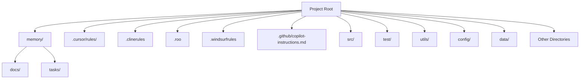

## Directory Structure

Below is the top-level directory structure from <em>clinerules/directory-structure</em>. This structure is central to how the project is organized:

• <code>.cursor/rules/</code> – Custom rules for Cursor  
• <code>.clinerules/</code> – Custom rules for CLINE
• <code>.roo/</code> – Custom rules for Roo Code
• <code>.windsurfrules</code> – Custom rules for Windsurf
• <code>.github/copilot-instructions.md</code> – Custom rules for Github Copilot  
• <code>memory/docs/</code> – Project documentation, architecture, and reference materials  
• <code>memory/tasks/</code> – Task plans, active context, RFCs, and general to-do items  
• <code>src/</code> – Main source code  
• <code>test/</code> – Testing suite  
• <code>utils/</code> – Utility scripts or libraries  
• <code>config/</code> – Configuration files  
• <code>data/</code> – Data resources  
• (and potentially more directories as the project grows)

## Core Principles
The main aim of this template is to have rules that are fundamentally backed by software engineering concepts and have a documentation that is usually followed in large software teams.

The same documentation will form the context for the AI Coding.
Now, these same rules have been written for Cursor, CLINE and Windsurf custom rules format. Thus, having a uniform rule based across these systems. And as the context is saved as documentation in the files, so it is platform agnostic.

This template is built upon two fundamental pillars:

**a) Software Engineering Best Practices:**  Embracing time-tested methodologies to ensure code quality, maintainability, and efficiency.

**b) Software Development Documentation:**  Leveraging comprehensive documentation to provide context, guide development, and serve as persistent memory for AI coding assistants.

By combining these principles, the Rules Template aims to provide a structured and reliable approach to AI-assisted coding.
And based on the popular knowledge and research in these two fileds, we came up with this template.