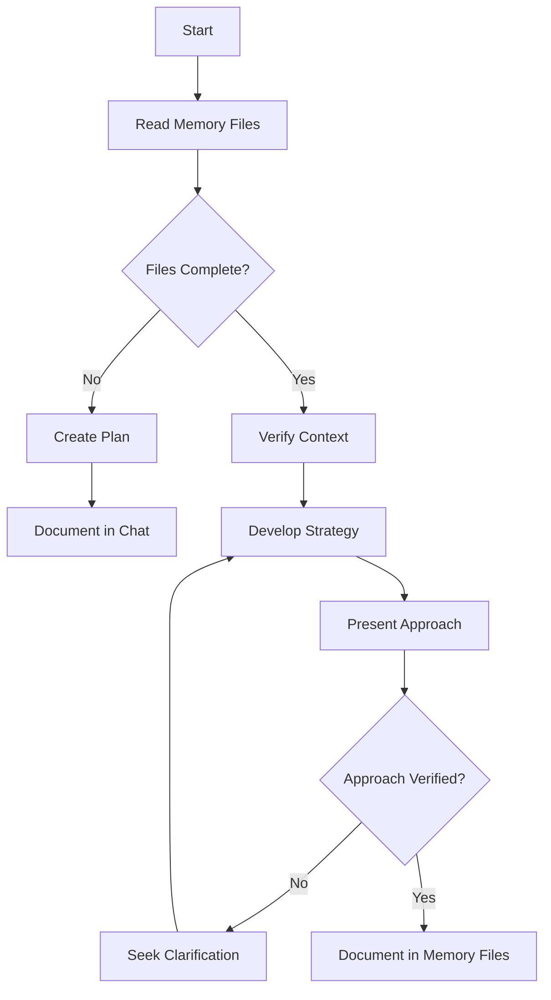
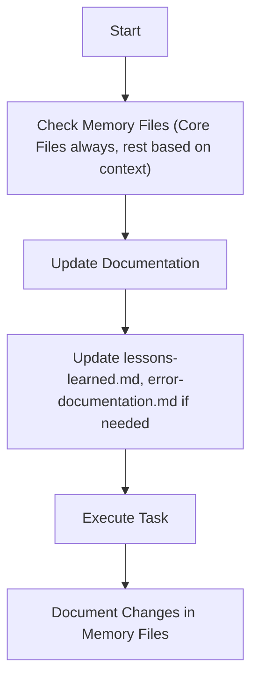
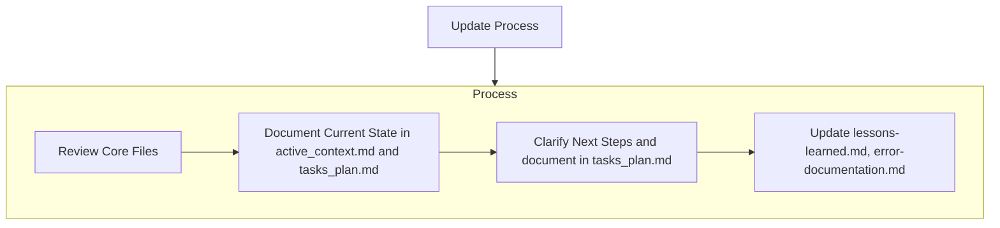
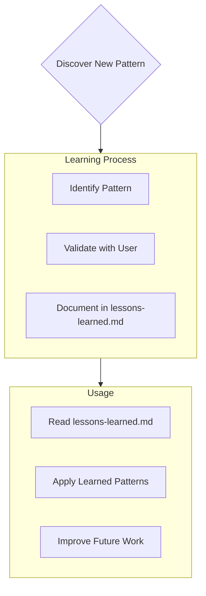

# Sprint-Based Memory Files Structure
This outlines the fundamental principles, required files, workflow structure, and essential procedures that govern sprint-based documentation and memory management using the file system.
The Sprint Memory Files consist of required core files organized around sprint cycles and project evolution:

```mermaid
flowchart TD
    PB[product_requirement_docs.md] --> PC[technical.md]
    PB --> SP[architecture.md]

    SP --> TC[sprint_plan.md]
    PC --> TC
    PB --> TC
    
    TC --> AC[active_context.md]
    TC --> SH[sprint_history.md]

    AC --> ER[error-documentation.md]
    AC --> LL[lessons-learned.md]
    AC --> SR[sprint_retrospective.md]
    
    SH --> SR
    SR --> TC
    
    subgraph SPRINT_DOCS[ Sprint Documentation ]
        SD1[Sprint Goals & Acceptance Criteria]
        SD2[Sprint Backlog & Stories]
        SD3[Sprint Progress & Velocity]
        SD4[Sprint Retrospectives]
    end
    
    subgraph LIT[ @/docs/literature ]
        L1[Sprint Methodology References]
        L2[Development Best Practices]
    end
        R2[...]
    end
    
    PC --o LIT
    TC --o RFC

``` 
## Core Sprint Files (Required)
  8 files organized around sprint methodology: 
  1. [product_requirement_docs.md](mdc:/memory/docs/product_requirement_docs.md) (/memory/docs/product_requirement_docs.md): Product Requirement Document (PRD) for the project or an SOP. 
  - Why this project exists and sprint goals alignment
  - Problems it solves per release/iteration
  - Defines core requirements and sprint-deliverable features
  - Foundation document that shapes sprint planning
  - Source of truth for project scope and sprint boundaries
  - Updated at sprint boundaries to reflect evolving requirements

  2. [architecture.md](mdc:/memory/docs/architecture.md) (/memory/docs/architecture.md): System architecture with sprint evolution
  - How it should work and architectural decisions per sprint
  - Component relationships and their sprint-based development
  - Dependencies and their delivery timeline
  
  3. [technical.md](mdc:/memory/docs/technical.md) (/memory/docs/technical.md): Development environment and technical sprint decisions
  - Technologies used and technical debt management
  - Development setup and sprint tooling
  - Key technical decisions made during sprints
  - Design patterns adopted per sprint cycle
  - Technical constraints and sprint impact

  4. [sprint_plan.md](mdc:/memory/tasks/sprint_plan.md) (/memory/tasks/sprint_plan.md): Current and historical sprint planning
  - Sprint goals, acceptance criteria, and commitments
  - Sprint backlog and story breakdown
  - Sprint progress tracking and velocity metrics
  - Sprint retrospective learnings and improvements
  - Historical sprint data for planning accuracy
  
  5. [active_context.md](mdc:/memory/tasks/active_context.md) (/memory/tasks/active_context.md): Current sprint state and daily progress
  - Current sprint focus and daily progress
  - Active sprint decisions and blockers
  - Recent sprint changes and adaptations
  - Next sprint steps and preparation

  6. [sprint_history.md](mdc:/memory/tasks/sprint_history.md) (/memory/tasks/sprint_history.md): Completed sprints and project evolution
  - Historical record of completed sprints
  - Sprint goals achieved and missed
  - Sprint retrospective outcomes and actions
  - Project evolution timeline and major milestones

  7. [error-documentation.md](mdc:/rules_template/01-rules/error-documentation.md) (/rules_template/01-rules/error-documentation.md): Sprint-context error tracking
  - Sprint-related errors and resolutions
  - Blockers encountered during sprints and how they were resolved
  - Technical debt identified and managed per sprint
  - Known issues: their state, context, and sprint impact

  8. [lessons-learned.md](mdc:/rules_template/01-rules/lessons-learned.md) (/rules_template/01-rules/lessons-learned.md): Sprint methodology learning journal
  - Sprint-specific patterns, preferences, and team intelligence
  - Sprint retrospective insights and process improvements
  - Velocity patterns and estimation accuracy learnings
  - Team dynamics and collaboration insights from sprints

## Context Files (Optional)
Detailed docs. Retrieve on demand if needed for context.

1. /docs/literature/ :
  - literature survey and researches are in this directory  
  - Each literature topic is a latex file (docs/literature/*.tex)

2. /tasks/rfc/ :
  - contains RFC for each individual task in @tasks_plan.md
  - RFCs will be in latex file format (tasks/*.tex)

## Additional Context
Create additional files or folders as Memory files in docs/ or tasks/ when they help organize:
- Integration specifications
- Testing strategies
- Benchmarking setups
- Possible Extensions
- Deployment procedures

# Core Workflows
Now we define the procedural workflows to read/write to these memeory files.
The system operates in distinct MODES: (PLAN/ACT) or analogously (Architect/Code), controlled exclusively by the user input or the task in current request. Current input will determine the MODE, based on which the Workflow selection is always dictated. In user input explicit mode setting can also be specified by "MODE = PLAN MODE"/"Architect MODE" or "MODE = ACT MODE"/"Code MODE", so if explicit MODE setting present follow that, else guess the mode from the request. Ask for the MODE if you are not 100% confident, if any doubt ask explicitely.

## PLAN or Architect MODE


## ACT or Code MODE


# Documentation Updates

Memory Files updates occur when:
1. Discovering new project patterns
2. After implementing significant changes
3. When user requests with **update memory files** (MUST review ALL Core Files)
4. When context needs clarification
5. After significant part of Plan is verified



Note: When triggered by **update memory files**, I MUST review every Core memory  file, even if some don't require updates. Focus particularly on [active_context.md](mdc:/memory/tasks/active_context.md) and [tasks_plan.md](mdc:/memory/tasks/tasks_plan.md) as they track current state.

# Project Intelligence ( [lessons-learned.mdc](mdc:/rules_template/01-rules/lessons-learned.mdc) [/rules_template/01-rules/lessons-learned.mdc] )

The [lessons-learned.mdc](mdc:/rules_template/01-rules/lessons-learned.mdc) file is my learning journal for each project. It captures important patterns, preferences, and project intelligence that help me work more effectively. As I work with you and the project, I'll discover and document key insights that aren't obvious from the code alone.



## What to Capture
- Critical implementation paths
- User preferences and workflow
- Project-specific patterns
- Known challenges
- Evolution of project decisions
- Tool usage patterns

The format is flexible - focus on capturing valuable insights that help me work more effectively with you and the project. Think of [lessons-learned.md](mdc:/rules_template/01-rules/lessons-learned.md) as a living document that grows smarter as we work together.
